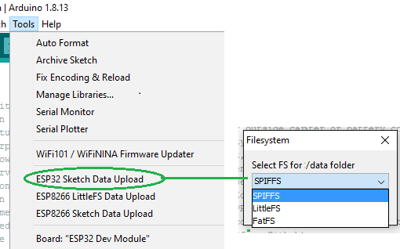

# Arduino ESP32 filesystem uploader 

- Arduino plugin which packs sketch data folder into SPIFFS, LittleFS or FatFS filesystem image,
and uploads the image to ESP32 flash memory. 
- Added a choice to "Erase all flash"
- You can have only one of three filesystems on same Arduino project.

## Notes for SPIFFS

- This is the default filesystem implemented in esp-32 core for /data folder
- Go to Arduino IDE menu: ***Tools > Partition Scheme*** and select an entry with SPIFFS partition


## Notes for LittleFS

- Same partition scheme as SPIFFS
- Until fully implemented to esp-32 core, it needs an extra library.  
It is already considered for next core releases. The mklittlefs tool is provided from there.
- For reference see [LITTLEFS esp32 library](https://github.com/lorol/LITTLEFS) for more details
- If you need the [mklittlefs tool](https://github.com/earlephilhower/mklittlefs) download the [release](https://github.com/earlephilhower/mklittlefs/releases) or find it [archived at previous releases here](https://github.com/lorol/arduino-esp32fs-plugin/releases )
- Copy **mklittlefs[.exe]** to **/tools** folder of esp32 platform where **espota** and **esptool** (.py or.exe) tools are located

## Notes for FatFS

- Go to Arduino IDE menu: ***Tools > Partition Scheme*** and select an entry with FAT partition
- If not provided by the core, you may need additional binary files for Windows or Linux, thanks [@lbernstone](https://github.com/lbernstone) for compiling - or take them from the author [here - mkfatfs tool](https://github.com/labplus-cn/mkfatfs/releases/tag/v1.0) , thanks to [labplus-cn](https://github.com/labplus-cn/mkfatfs) or take from [archived previous release here](https://github.com/lorol/arduino-esp32fs-plugin/releases )
- If missing, you need to copy **mkfatfs[.exe]** to **/tools** folder of esp32 platform where **espota** and **esptool** (.py or.exe) tools are located
- The usable size of FAT partition is reduced with 1 sector of 4096 bytes (0x1000) to resolve wear leveling space requirement. The image file is flashed with +4096 bytes (0x1000) offset of partition address of csv table entry
- You may need to decrease **maxOpenFiles** at FFat.begin() of your sketch , [see this note](http://marc.merlins.org/perso/arduino/post_2019-03-30_Using-FatFS-FFat-on-ESP32-Flash-With-Arduino.html) 
>The FFAT module uses 8KB plus 4KB per concurrent file that can be opened. By default, it allows 10 files to be opened, which means it uses 48KB. IF you want to reduce its memory use, you can tell it to only support one file, and you will save 36KB, leaving you with only 12KB used.
```
if (!FFat.begin(0, "", 1)) die("Fat FS mount failed. Not enough RAM?");
```
- To flash the data folder as FAT partition by **network port (uses espota)**, replace your esp32-core Update library with the [modified files here](https://github.com/lorol/arduino-esp32fatfs-plugin/tree/master/extra/esp32-modified-Update-lib-ffat-espota.zip)

## Installation

- Make sure you use one of the supported versions of Arduino IDE and have ESP32 core installed.
- Download **esp32fs.zip** zipped tool from [latest release](https://github.com/lorol/arduino-esp32fs-plugin/releases)
- In your Arduino sketchbook directory, create tools directory if it doesn't exist yet.
- Unpack the tool into tools directory (the path will look like ```<home_dir>/Arduino/tools/ESP32FS/tool/esp32fs.jar```).
- Make sure you have **mklittlefs[.exe]** and **mkfatfs[.exe]** available at **/tools** folder or in sub-folder there
- For reference, see at [previous releases](https://github.com/lorol/arduino-esp32fs-plugin/releases) for copies of archived binaries in question. 
- You can also use provided **package_esp32_index.template.json** to run **get.py** with it and download the missing binary files
- Restart Arduino IDE. 

## Usage

- Open a sketch (or create a new one and save it).
- Go to sketch directory (choose Sketch > Show Sketch Folder).
- Create a directory named `data` and any files you want in the file system there.
- Make sure you have selected a board, port, partition scheme and closed Serial Monitor.
- Select ***Tools > ESP32 Sketch Data Upload*** menu item. 
- On drop-down list, select SPIFFS, LittleFS or FatFS you want to make from your /data folder.
- Clicking OK should start uploading the files into ESP32 flash file system.
- Last entry **!Erase Flash!** allows to clean the entire flash if necessary. 

  When done, IDE status bar will display the status of Image Uploaded message. Might take a few minutes for large file system sizes.
  
## Screenshot



## Quick build on Win:

- Install Java JDK 
- Find the path of javac.exe and jar.exe
- Edit **make_win.bat** accordingly
- Copy files **arduino-core.jar , commons-codec-1.7.jar , pde.jar**  from your Arduino IDE installation to the folder where is located **make_win.bat**
- Run **make_win.bat**
- Find the **jar** file in /bin directory 

## Credits and license

### The Original Arduino ESP32 filesystem uploader

- Copyright (c) 2015 Hristo Gochkov (hristo at espressif dot com)
- Licensed under GPL v2 ([text](LICENSE))
- Maintained by Hristo Gochkov (hristo at espressif dot com)

### Other people, sources and binary files

- https://github.com/earlephilhower
- https://github.com/labplus-cn/mkfatfs
- https://github.com/lbernstone

## Issues and suggestions

File issues here on github, or ask your questions on the [esp32.com forum](http://esp32.com).
